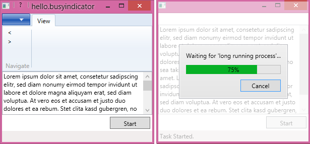

# Hello.BusyIndicator

A Wpf sample for using [Xceeds BusyIndicator](http://wpftoolkit.codeplex.com/wikipage?title=BusyIndicator&referringTitle=Home) in a decoupled, testable and [MVVM](http://en.wikipedia.org/wiki/Model_View_ViewModel)-friendly way with [Caliburn.Micro](http://caliburnmicro.com/) and [AutoFac](http://autofac.org/) using including support for cancellation and optional progress. The sample app also shows how to deal smoothly with the [Windows Ribbon](https://msdn.microsoft.com/en-us/library/ff799534%28v=vs.110%29.aspx) which in general does not play well with MVVM.

## Usage

For the standard use case just wrap your main screen with a busy indicator. Let's say your main screen is an implementation of `IAppViewModel` and this is the main screen you set up in the bootstrapper, i.e.

    public class AppBootstrapper : AutofacBootstrapper<IAppViewModel>>
    {
		...
	    protected override void OnStartup(object sender, StartupEventArgs e)
	    {
	        DisplayRootViewFor<IAppViewModel>();
	    }

Then just wrap it into a `IBusyViewModel<>` like this

    protected override void OnStartup(object sender, StartupEventArgs e)
    {
        DisplayRootViewFor<IBusyViewModel<IAppViewModel>>();
    }

and additionally register an implementation 

        protected override void ConfigureContainer(ContainerBuilder builder)
        {
            builder.RegisterType<BusyViewModel<IAppViewModel>>()
				.As<IBusyViewModel<IAppViewModel>>()
				.InstancePerLifetimeScope();
			...
        }
    }

To fire off a long running task from anywhere publish a `TaskMessage` to caliburns event aggregator like this

        public void Start()
        {
            var message = new TaskMessage(MyLongRunningTask,
                $"Waiting for '{GetType().Name}'...");
            _events.PublishOnUIThread();
        }

        public bool CanStart => _events.HandlerExistsFor(typeof(TaskMessage));

        private static void MyLongRunningTask(CancellationToken token, IProgress<int> progress)
        {
            const int n = 20;
            var duration = TimeSpan.FromSeconds(20);

            for (int i = 1; i <= n; i++)
            {
                token.ThrowIfCancellationRequested();
                Thread.Sleep( (int)(duration.TotalMilliseconds / n) );
                progress?.Report((100 * i) / n);
            }
        }

The `BusyViewModel` handles the message by starting a new task and awaiting it

	public async Task Handle(TaskMessage message)
    {
        using (_taskMessage = message)
        {
            _events.PublishOnUIThread(new NotificationEvent("Task started."));

            WaitingFor = message.WaitingFor;
            Progress = -1;
            IsBusy = true;
            try
            {
                await message.Run(new Progress<int>(p => Progress = p));
                _events.PublishOnUIThread(new NotificationEvent("Task completed."));
            }
            catch (OperationCanceledException)
            {
                _events.PublishOnUIThread(new NotificationEvent("Task canceled."));
            }
            finally { IsBusy = false; }
        }
    }

Cancellation goes like this

        public void Cancel()
        {
            WaitingFor = "Canceling...";
            Progress = -1;
            _taskMessage?.CancelAfter(TimeOut);
        }
 